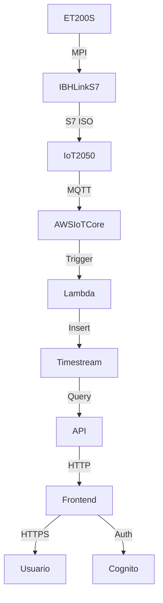

# 🏭 Sistema de Monitoreo IoT para Pasteurizador Industrial


Este proyecto implementa una solución de monitoreo en tiempo real para variables críticas de un proceso de pasteurización industrial. A través de la integración de hardware Siemens, servicios en la nube AWS y un dashboard web, se logra una arquitectura escalable, segura y eficiente.

---

## 📌 Descripción

El sistema recolecta datos desde un **PLC Siemens ET200S** con comunicación MPI/Profibus, conectado a un **Siemens IoT2050** mediante un gateway **IBH Link S7++**. Los datos se publican a **AWS IoT Core**, son procesados por una **función Lambda**, almacenados en **AWS Timestream** y visualizados en un **frontend protegido con Amazon Cognito**, desplegado en **S3 + CloudFront**.

---

## 🧠 Arquitectura del Flujo de Datos


1. **Recolección:** El ET200S transmite datos (temperatura y flujo) mediante MPI.
2. **Conversión:** El IBHLink S7++ convierte MPI a S7 ISO-on-TCP.
3. **Edge Computing:** El IoT2050 adquiere datos vía Node-RED y los publica por MQTT a AWS IoT Core.
4. **Procesamiento:** AWS IoT Core dispara una Lambda que transforma y almacena los datos en Timestream.
5. **Extracción:** Una API consulta eficientemente los datos de Timestream usando SQL con `row_number()`.
6. **Visualización:** El frontend (S3 + CloudFront) consume los datos vía HTTP y muestra gráficas y filtros, con acceso controlado por Cognito.

---

## 🚀 Instalación y Despliegue

### Requisitos

- Node.js y npm
- Cuenta en AWS con permisos sobre: IoT Core, Lambda, Timestream, Cognito, S3, CloudFront

### Instalación local

```bash
cd frontend
npm install
npm run dev
```

### Construcción para producción

```bash
npm run build
```

El contenido generado en `dist/` debe subirse a un bucket S3 configurado para hosting estático.

### Despliegue en AWS

- Sube el contenido de `dist/` a tu bucket S3
- Configura CloudFront para servir desde el bucket
- Protege el acceso con autenticación OAuth2 vía Amazon Cognito

---

## 🖥️ Uso

1. Accede a la URL pública distribuida por CloudFront.
2. Inicia sesión mediante Amazon Cognito.


3. Visualiza las variables del proceso industrial en tiempo real, con opción de filtrar por fechas y descargar CSV.


---

## 🛠 Tecnologías Utilizadas

- **Hardware:** Siemens ET200S, IBH Link S7++, Siemens IoT2050
- **Edge & Comunicaciones:** Node-RED, MQTT, AWS IoT Core
- **Procesamiento y Almacenamiento:** AWS Lambda, AWS Timestream
- **Frontend:** Vite, JavaScript, HTML, CSS, Chart.js
- **Seguridad y Despliegue:** Amazon Cognito, S3, CloudFront

---

## 📈 Diagrama del Flujo (Mermaid)



---

## 📬 Contacto

- **Autor:** Christian Raul Povis Arestegui  
- **Email:** christian.povis@gmail.com
